# 🎙️ Voice Authentication System

A secure, AI-powered Two-Factor Authentication (2FA) system that uses your **Voice** as your password. This project combines **Speaker Verification** (Biometrics) with **Content Verification** (Liveness Check) to prevent replay attacks.

## 🚀 Features

-   **Voice Biometrics**: Uses **SpeechBrain (ECAPA-VoxCeleb)** to generate a unique 192-dimensional embedding for each user.
-   **Liveness Detection**: Uses **OpenAI Whisper** to verify the user is reciting a randomly generated challenge phrase.
-   **Anti-Spoofing**: Prevents attackers from using pre-recorded audio by enforcing a dynamic challenge text.
-   **Modern UI**: Cyberpunk-themed frontend for easy interaction.

## 📊 System Pipeline

```mermaid
graph TD
    subgraph "Registration Phase"
        A[User Speaks] -->|Mic Input| B(WebM Audio)
        B -->|FFmpeg| C(WAV Audio 16kHz)
        C -->|SpeechBrain Model| D[Generate Embedding Vector]
        D -->|Save| E[(User Database)]
    end

    subgraph "Login Verification Phase"
        F[User Requests Login] --> G{Get Challenge Phrase}
        G --> H[User Recites Phrase]
        H -->|Mic Input| I(WebM Audio)
        I -->|FFmpeg| J(WAV Audio 16kHz)
        
        J -->|Step 1: Whisper Model| K(Transcribe Text)
        K -->|Compare| L{Text Matches Challenge?}
        
        J -->|Step 2: SpeechBrain Model| M(Generate Login Embedding)
        M -->|Compare Cosine Similarity| N{Matches Saved User?}
        
        L -- Yes --> N
        L -- No --> O[Access Denied ❌]
        N -- Yes --> P[Login Successful ✅]
        N -- No --> O
    end
```



## 🛠️ How It Works

### 1. Registration (Enrollment)
1.  **Capture**: The system records 15-30 seconds of the user's voice.
2.  **Processing**: The audio is converted to valid WAV format.
3.  **Embedding**: An AI model extracts a mathematical vector (fingerprint) of the voice.
4.  **Storage**: This "Voiceprint" is stored securely.

### 2. Login (Verification)
1.  **Challenge**: The server generates a random phrase (e.g., *"The sun rises in the east"*).
2.  **Input**: The user must read this phrase aloud.
3.  **Verification Engine**:
    *   **Layer 1 (Liveness)**: Did the user say the correct phrase? (Checks for spoofing/recordings).
    *   **Layer 2 (Identity)**: Is the speaker the registered user? (Checks voice characteristics).
4.  **Result**: Access is granted only if **BOTH** checks pass with high confidence.

## 📦 Installation & Setup

1.  **Prerequisites**:
    *   Python 3.9+
    *   FFmpeg (Installed and added to System PATH)

2.  **Install Dependencies**:
    ```bash
    pip install fastapi uvicorn speechbrain openai-whisper python-multipart scipy pydub torchaudio torch numpy soundfile huggingface_hub
    ```
    *(Note: On first run, the system will download ~1.5GB of pre-trained models)*

3.  **Run the Server**:
    ```bash
    cd backend
    uvicorn main:app --host 0.0.0.0 --port 8000
    ```

4.  **Access the App**:
    Open `http://localhost:8000` in your browser.

## 🔧 Technology Stack

-   **Backend**: FastAPI (Python)
-   **ML Models**:
    -   *Speaker Recognition*: `speechbrain/spkrec-ecapa-voxceleb`
    -   *Speech-to-Text*: `openai/whisper-tiny`
-   **Audio Processing**: FFmpeg, SoundFile, Torchaudio
-   **Frontend**: HTML5, CSS3, JavaScript (MediaRecorder API)
